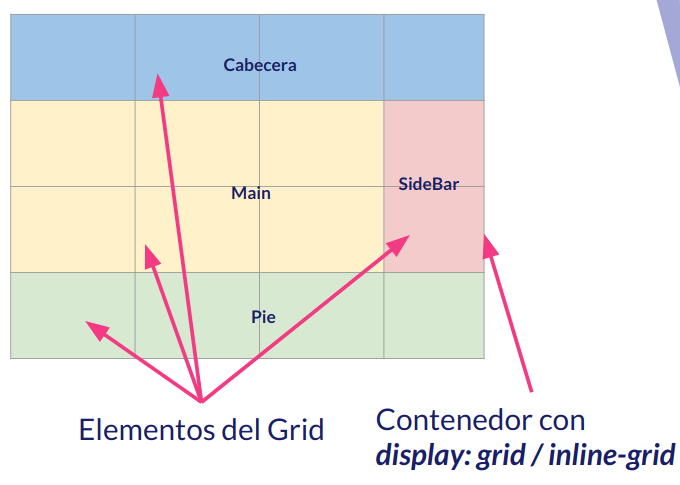

## III.1 Elementos de la maquetación Grid

La idea principal que hay detrás de la maquetación **GRID** es que vamos a tener un elemento, es decir, un etiqueta que nos va a permitir _controlar_ propiedades de los elementos que contiene y establecer **estructuras complejas** para distribuirlos.

Por lo tanto, en esta situación, vamos a poder distinguir dos tipos de elementos:

- El **contenedor GRID** que tendrá asignada la propiedad CSS _display:grid_ o _display:inline-grid_ la estructura y las propiedades de los elementos que contiene.
- Los **elementos GRID** que son los elementos que están dentro del contenedor, elementos que distribuiremos y cuyas propiedades modificaremos.

De manera visual podemos ver una distribución de los elementos en la siguiete imagen:

Pero, ¿qué podremos modificar desde el contenedor?:

- La estructura en filas y columnas y la separación entre ellas.
- Definir áreas del GRID con nombre.
- La alineación horizontal y vertical de los elementos del GRID y del propio GRID dentro del elemento que lo contiene.

Es decir, vamos a poder controlar propiedades que usamos para maquetar y además, vamos a poder maquetar de manera mucho más ágil a lo que lo hacemos con las técnicas tradicionales de maquetado.

Curso desarrollado por [pekechis](http://github.com/pekechis) para [OpenWebinars](https://openwebinars.net/)
