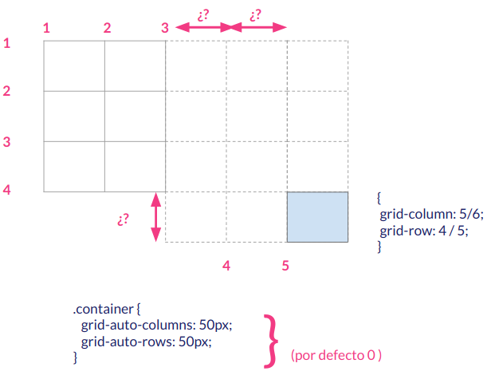

## III.3 Elementos GRID

Los **Elementos GRID** son los hijos directos, dentro del árbol DOM de nuestra página HTML, del elemento con la propiedad CSS **_display:grid_**.

De manera individual podemos modificar las propiedades de estos elementos para conseguir lo siguiente:

- Definir el área o zona del GRID (rejilla) que va a ocupar.
- Especificar la alineación horizontal del elemento.
- Especificar la alineación vertical del elemento.

Y además, existen ciertas reglas de colocación implícita que debemos de conocer.

### Área del elemento GRID

Para especificar el área que va a ocupar el elemento GRID lo haremos con las siguiente propiedades:

- **grid-column-start**
- **grid-column-end**
- **grid-row-start**
- **grid-row-end**

El significado de cada uno de ellos es prácticamente una traducción directa, pero lo vamos a entender mejor con un ejemplo:

Si tenemos el siguiente GRID:


Para definir el área de los elementos del GRID, que son tres, usaremos el siguiente CSS:

```css
#azul {
  background-color: blue;
  grid-column-start: 1;
  grid-column-end: 2;
  grid-row-start: uno;
  grid-row-end: cuatro;
}

#rojo {
  background-color: red;
  grid-column-start: 2;
  grid-column-end: 3;
  grid-row-start: uno;
  grid-row-end: dos;
}

#amarillo {
  background-color: yellow;
  grid-column-start: 2;
  grid-column-end: 5;
  grid-row-start: dos;
  grid-row-end: span 2;
}
```

Fijaros que puede especifiar el área que ocupa de tres maneras principalemente:

- Indicando el número de línea donde empieza y donde acaba.
- Indicando con nombres de líneas, que habremos definido al definir el contenedor, donde empieza y donde acaba.
- Indicando cuánto ocupa en la dirección en cuestión (fila o columna) y usando **span** y el valor de la extensión.

Podemos juntar estas propiedades:

```css
/* Para juntar las dos propiedades referentes a columnas */
grid-column: start / end;

/* Para juntar las dos propiedades referentes a filas */
grid-row: start / end;

/* Para junta las cuatro propiedades que nos permiten definir el área */
grid: row-start column-start row-end column-end;
```

### Alineación horizontal.

La alineación horizontal de un elemento de manera individual se consigue usando la propiedad **justify-self** que puede tomar los mismos valores y funciona igual que la propiedad **justify-items** que dábamos al contenedor GRID. Estos valores son:

- start
- end
- center
- stretch (por defecto)

### Alineación vertical.

La alineación vertical de un elemento de manera individual se consigue usando la propiedad **align-self** que puede tomar los mismos valores y funciona igual que la propiedad **align-items** que dábamos al contenedor GRID. Estos valores son:

- start
- end
- center
- stretch (por defecto)

### Colocación Implícita

La **colocación implícita** de los **elementos GRID** es lo que sucede cuando colocamos esos elementos **fuera** de la estructura del contenedor o cuando no les damos posición.

Cuando colocamos una elemento fuera de la estructura definida para su contenedor GRID podemos mantener cierto control añadiendo al contenedor (que no al elemento) las siguiente propiedades:

- **grid-auto-columns** Que dará tamaño a las columnas de separación entre los límites del contenedor y la posición donde hemos dejado nuestro elemento.
- **grid-auto-rows** Que dará tamaño a las filas de separación entre los límites del contenedor y la posición donde hemos dejado nuestro elemento.

Lo vamos a ver mejor en un ejemplo:



Al dar al contenedor las siguiente propiedades:

```css
.container {
  ... grid-auto-columns: 50px;
  grid-auto-rows: 50px;
  ...;
}
```

Las filas y las columnas con los interrogantes, que están fuera del grid que es 2x3, tendrán unas dimensiones de 50x50. Por defecto estos valores son 0.

En el caso de que no hayamos especificado el área que le corresponde a un elemento de GRID podemos establecer ciertas reglas del comportamiento mediante la propiedad **grid-auto-flow** que añadiremos al contenedor. Esta propiedad puede tomar varios valores:

- **row:** Rellena primero las filas. Es la opción por defecto.
- **column:** Rellena primero las columnas. Es la opción por defecto.
- **dense:** Intenta rellenar primero los huecos por si viene elementos posteriores más pequeño. Hay que tener cuidado al usar ésta porque puede provocar cambios de orden en los elementos.

Curso desarrollado por [pekechis](http://github.com/pekechis) para [OpenWebinars](https://openwebinars.net/)
