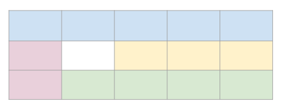

## III.4 Áreas GRID

Para acabar con el capítulo dedicado a GRID vamos a ver como podemos maquetar únicamente nombrando áreas. Para ello usaremos las siguiente propiedades:

- **grid-area** en los elementos GRID
- **gird-template-area** en el contenedor GRID.

Vamos a verlo mejor con un ejemplo. Si tenemos el siguiente GRID:



Se ha establecido la estructura del contenedor GRID de la siguiente manera:

```css
.container {
  grid-template-columns: repeat(5, 20%);
  grid-template-rows: repeat(3, 100px);
}
```

Daremos nombre al área que va a ocupar cada elemento del grid mediante la propiedad **grid-area**:

```css
#cab {
  background-color: blue;
  grid-area: cab;
}

#pie {
  background-color: green;
  grid-area: pie;
}

#menu {
  background-color: red;
  grid-area: menu;
}

#principal {
  background-color: yellow;
  grid-area: main;
}
```

Con esos nombre ya podemos añadir al contenedor la propiedad **grid-template-area** que define la estructura sin dar ninguna propiedad adicional a los elementos del Grid.

```css
.container {
  display: grid;
  grid-template-columns: repeat(5, 20%);
  grid-template-rows: repeat(3, 100px);
  grid-template-areas:
    "cab cab cab cab cab"
    "menu  .  main main main"
    "menu  pie pie pie pie";
}
```

Cada nombre representa el elemento que va a ocupar una celda. De esta manera, el contenido de cada fila va entre "" y:

- La **primera fila** será ocupada totalmente por el elemento con _grid-area:cab_;
- En la **segunda fila**, la primera celda para el elemento con _grid-area:menu_, luego un hueco que se indica con . y posteriormente tres celdas para el elemento con _grid-area:main_.
- En la **tercera fila** la primera celda es para el elemento con _grid-area:menu_ y el resto para el que tenga _grid-area:pie_

Una vez visto esto podemos juntar todas las propiedades grid-template-\* en una sola propiedad **grid-template**.

Además, ya no nos quedan por ver más propiedades del contenedor y podríamos juntar todas en la propiedad **grid**. Aunque yo, personalmente, prefiero tener más control y tener todo separado. Son tantas cosas que a veces si las juntamos perdemos el foco.

Curso desarrollado por [pekechis](http://github.com/pekechis) para [OpenWebinars](https://openwebinars.net/)
