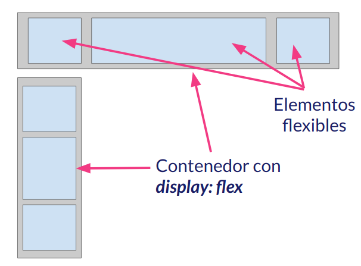

## II.1 Elementos de la maquetación FLEX

La principal idea que hay detrás de la maquetación **FLEX** es que vamos a tener un elemento, es decir, una etiqueta que va a poder _controlar_ las propiedades de los elementos que contiene.

Por lo tanto, en esta situación, vamos a poder distinguir dos tipos de elementos:

- El **contenedor flex** que tendrá asignada la propiedad CSS _display:flex_ y que va a controlar (ya veremos como) ciertas propiedades de los elementos que contiene. Los vemos en gris en la imagen inferior.
- Los **elementos flexibles** que son los elementos que están dentro del contenedor y cuyas propiedades modificaremos. Los vemos en azul en la imagen inferior.

Pero, ¿qué tipo de propiedades podremos modificar? Puede podremos modificar propiedades CSS como:

- La altura de los elementos flexibles.
- La anchura.
- El orden en el que se nos van a presentar.
- La alineación vertical.
- La alineación horizontal.
- La distribución de los elementos flexibles a lo largo del contenedor.

Es decir, vamos a poder controlar propiedades que usamos para maquetar y además, vamos a poder maquetar de manera mucho más ágil a lo que lo hacemos con las técnicas tradicionales de maquetado.

Curso desarrollado por [pekechis](http://github.com/pekechis) para [OpenWebinars](https://openwebinars.net/)
